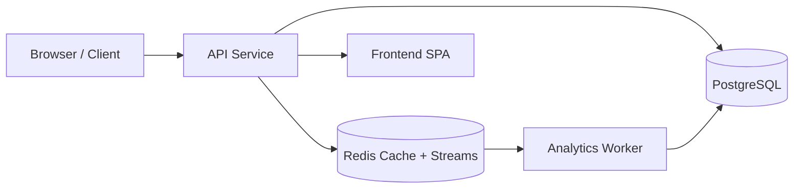
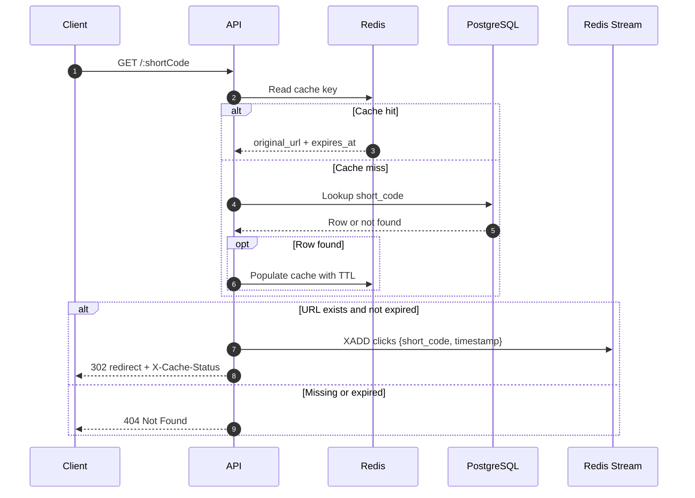
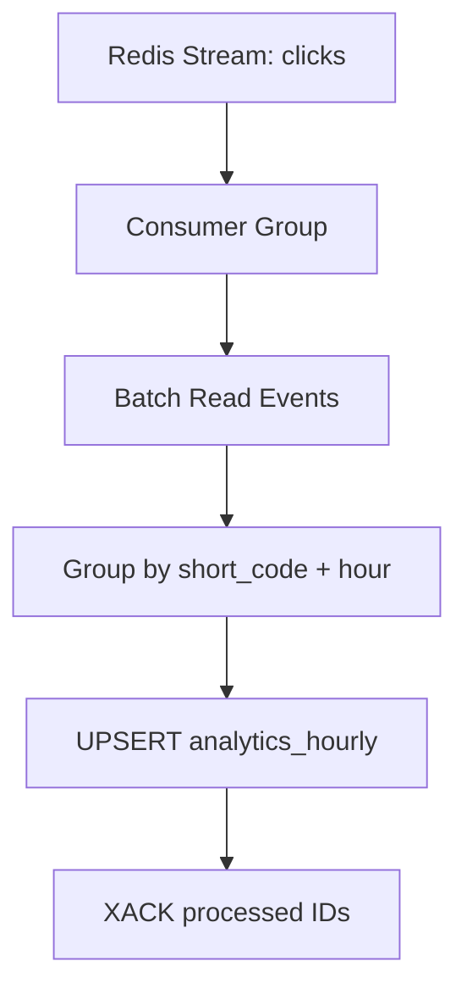

# SnapURL

SnapURL is a distributed URL shortener built to demonstrate a clean separation between a low-latency redirect path and an asynchronous analytics pipeline. The project uses PostgreSQL for durable storage, Redis for caching and stream-based event delivery, Node.js for the API and worker services, and a small browser UI for link creation and analytics visualization.

## Overview

The system solves the classic URL-shortening problem in a distributed way. Short codes are generated without auto-increment IDs, redirects are accelerated through a read-through Redis cache, and click analytics are processed out of band by a worker that consumes Redis Streams and writes hourly aggregates into PostgreSQL.



## Tech Stack

| Layer | Technology | Purpose |
| --- | --- | --- |
| API | Node.js + Express | REST endpoints, redirects, analytics, and static asset hosting |
| Worker | Node.js | Consumes click events from Redis Streams and updates analytics |
| Database | PostgreSQL 15 | Persistent source of truth for URL mappings and aggregates |
| Cache / Broker | Redis 7 | Read-through cache and click-event stream |
| Frontend | HTML, CSS, Vanilla JS, Chart.js | URL shortening form and analytics visualization |
| Benchmarking | k6 | Load and latency testing under concurrent access |
| Orchestration | Docker Compose | Local, reproducible multi-service runtime |

## How It Works

### Redirect Workflow



### Analytics Workflow



## Folder Organization

```text
Gpp-20/
├── api/
│   ├── Dockerfile
│   ├── package.json
│   ├── public/
│   │   ├── index.html
│   │   └── style.css
│   └── src/
│       ├── db.js
│       ├── idGenerator.js
│       ├── index.js
│       └── routes.js
├── worker/
│   ├── Dockerfile
│   ├── package.json
│   └── src/
│       └── worker.js
├── db/
│   └── init.sql
├── docker-compose.yml
├── k6.js
├── BENCHMARK.md
├── architecture.md
├── projectdocumentation.md
├── README.md
└── .env.example
```

## Local Setup

### Prerequisites

- Docker Desktop or Docker Engine with Compose support
- Git

### Installation and Startup

```bash
git clone <repository-url>
cd Gpp-20
docker compose up --build -d
docker compose ps
```

The compose file starts four services: `api`, `worker`, `db`, and `redis`. The database is seeded automatically from [db/init.sql](db/init.sql), and healthchecks gate startup so the application only begins once the dependencies are ready.

### Environment Variables

Copy [.env.example](.env.example) to your local environment if you want to run the services outside Compose. The most important variables are `DATABASE_URL`, `REDIS_URL`, `PORT`, `BASE_URL`, `NODE_ID`, and `WORKER_NAME`.

## Usage

### Frontend

Open `http://localhost:3000`.

- Enter a long URL.
- Select `hash` or `snowflake`.
- Optionally set an expiration timestamp.
- Click the shorten button.
- Copy the returned short URL and open the analytics view from the link shown in the result panel.

### API Examples

```bash
curl -X POST http://localhost:3000/api/shorten \
  -H "Content-Type: application/json" \
  -d '{"url":"https://www.google.com/search?q=distributed+systems","strategy":"hash"}'
```

```bash
curl -X POST http://localhost:3000/api/shorten \
  -H "Content-Type: application/json" \
  -d '{"url":"https://en.wikipedia.org/wiki/Snowflake_ID","strategy":"snowflake","expires_at":"2027-01-01T00:00:00Z"}'
```

```bash
curl http://localhost:3000/api/analytics/<shortCode>
```

### Redirect Verification

```bash
curl -I -L --max-redirs 0 http://localhost:3000/<shortCode>
```

Check for the `Location` header and the `X-Cache-Status` response header.

## Benchmarking

Run the included k6 script against the API service:

```bash
docker run --rm -i \
  --network="gpp-20_shortener-network" \
  -v "${pwd}:/apps" \
  -e BASE_URL="http://api:3000" \
  -e STRATEGY="snowflake" \
  grafana/k6 run /apps/k6.js
```

Results and analysis belong in [BENCHMARK.md](BENCHMARK.md).

## Verification Checklist

- `docker compose up --build -d` starts all four services.
- [db/init.sql](db/init.sql) creates the required tables and constraints.
- `POST /api/shorten` returns a short URL for both strategies.
- `GET /:shortCode` redirects with cache hit/miss headers.
- Redis publishes click events to the `clicks` stream.
- The worker updates `analytics_hourly` asynchronously.
- `GET /api/analytics/:shortCode` returns the hourly time series.

## Documentation Map

- [architecture.md](architecture.md) contains the full system architecture, component responsibilities, and design trade-offs.
- [projectdocumentation.md](projectdocumentation.md) contains the deep technical narrative, problem-solving approach, advantages, and limitations.
- [BENCHMARK.md](BENCHMARK.md) records load-test findings and performance analysis.
