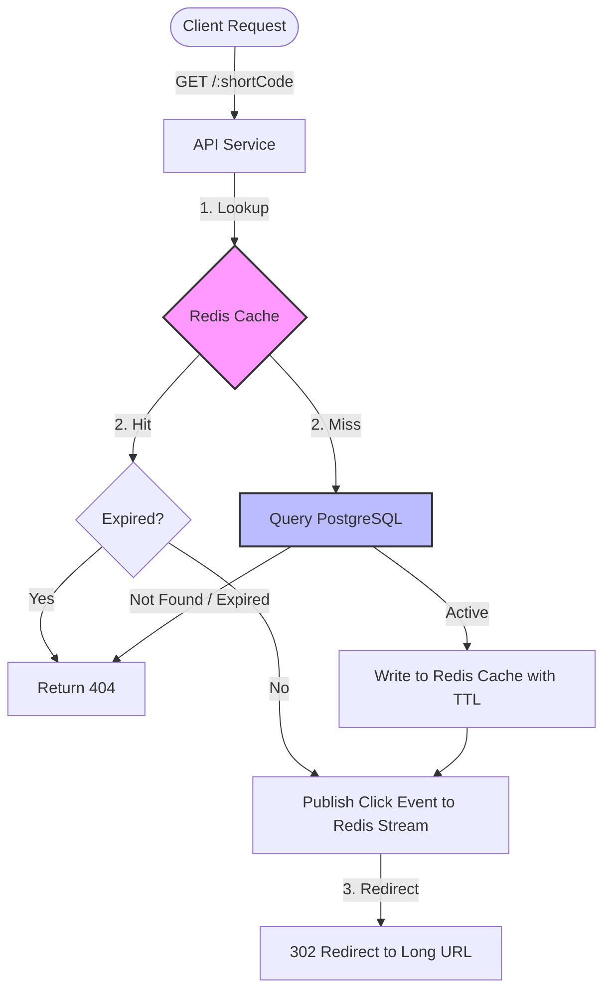
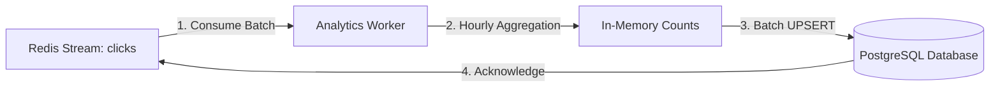

# ⚡ SnapURL — Distributed URL Shortener

[](https://www.docker.com/)
[](https://redis.io/)
[](https://www.postgresql.org/)
[](https://nodejs.org/)
[](https://k6.io/)

SnapURL is a production-grade, highly scalable distributed URL shortener designed to support high concurrent load. It uses decentralised, collision-resistant ID generation strategies, sub-millisecond read-through caching, and asynchronous event streams to handle billions of redirections daily.

---

## 🏗️ System Architecture & Execution Flow

SnapURL splits execution into a **synchronous hotspot path** (designed for sub-millisecond redirection response times) and an **asynchronous cold path** (decoupling analytical write loads).

### Redirection & Cache Resolution Workflow
When a redirection request is received, the API service checks the caching layer first. If it's a hit, the user is redirected immediately, and a click log is dispatched to a Redis Stream asynchronously.



### Asynchronous Analytics & Aggregation Workflow
A background worker consumes events from the click stream in batches and aggregates them hourly in memory before committing changes to the database.



---

## 🛠️ Technology Stack

SnapURL relies on standard systems tools to maintain low footprint and high scalability:
- **Backend Services**: Node.js (ESM), Express.
- **Database (Source of Truth)**: PostgreSQL 15 (supporting transactions and indices).
- **Speed & Queue Layer**: Redis 7 (utilising caching keys and Redis Streams with Consumer Groups).
- **Frontend SPA**: Vanilla HTML5, modern HSL CSS variables, glassmorphic UI, and Chart.js.
- **Benchmarking**: k6 load generator.
- **Orchestration**: Docker and docker-compose.

---

## 📂 Codebase & Folder Organization

```
Gpp-20/
├── api/
│   ├── public/              # Static Frontend SPA Assets
│   │   ├── index.html       # Sleek UI Dashboard with Chart.js
│   │   └── style.css        # Glassmorphic Dark-Mode Stylesheet
│   ├── src/                 # API Server Source Code
│   │   ├── db.js            # Redis and Postgres DB connection pool
│   │   ├── idGenerator.js   # Hash and Snowflake ID generators
│   │   ├── index.js         # Express app entrypoint
│   │   └── routes.js        # API endpoints and redirection handlers
│   ├── Dockerfile
│   └── package.json
├── worker/
│   ├── src/
│   │   └── worker.js        # Background event processor loop
│   ├── Dockerfile
│   └── package.json
├── db/
│   └── init.sql             # Postgres DDL seeding script
├── .env.example             # Template for local environment vars
├── docker-compose.yml       # Docker services configuration
├── k6.js                    # Load test script
├── BENCHMARK.md             # k6 benchmarking report
├── architecture.md          # Architectural and layout diagrams
├── projectdocumentation.md   # Product documentation
└── README.md                # System overview and startup manual
```

---

## 🚀 Running the Project Locally

### 1. Prerequisites
Ensure you have the following installed:
- [Docker & Docker Compose](https://www.docker.com/products/docker-desktop)
- [Git](https://git-scm.com/)

### 2. Setup and Installation
Clone the repository and spin up the containerized network:

```bash
# Clone the repository
git clone https://github.com/ramalokeshreddyp/distributed-url-shortener.git
cd distributed-url-shortener

# Build and start all services in detached mode
docker-compose up --build -d
```

Verify that all containers (`api`, `worker`, `db`, `redis`) start and show a healthy status:

```bash
docker-compose ps
```

### 3. Usage Instructions

#### Accessing the UI
Open your browser and navigate to **[http://localhost:3000](http://localhost:3000)**. 
- Enter a long URL, select the generation strategy (Hash or Snowflake), and set an optional expiration date.
- Click **Generate Short Link**.
- Copy the short URL and test redirecting by pasting it into a new tab.
- Click **View Analytics Dashboard** to view a real-time Chart.js time-series analysis of click volume.

#### Testing REST Endpoints

**Shorten a URL (Hash Strategy)**:
```bash
curl -X POST http://localhost:3000/api/shorten \
  -H "Content-Type: application/json" \
  -d '{"url": "https://www.google.com/search?q=distributed+systems", "strategy": "hash"}'
```

**Shorten a URL (Snowflake Strategy + Expiration)**:
```bash
curl -X POST http://localhost:3000/api/shorten \
  -H "Content-Type: application/json" \
  -d '{"url": "https://en.wikipedia.org/wiki/Snowflake_ID", "strategy": "snowflake", "expires_at": "2027-01-01T00:00:00Z"}'
```

**Query Analytics**:
```bash
curl http://localhost:3000/api/analytics/<shortCode>
```

---

## 📊 Performance Testing

Run the benchmark suite using `k6` to see how the system performs under load:

```bash
docker run --rm -i --network="gpp-20_shortener-network" -v "${pwd}:/apps" -e BASE_URL="http://api:3000" -e STRATEGY="snowflake" grafana/k6 run /apps/k6.js
```
*Note: Check out [BENCHMARK.md](BENCHMARK.md) to view the performance metrics comparison.*
