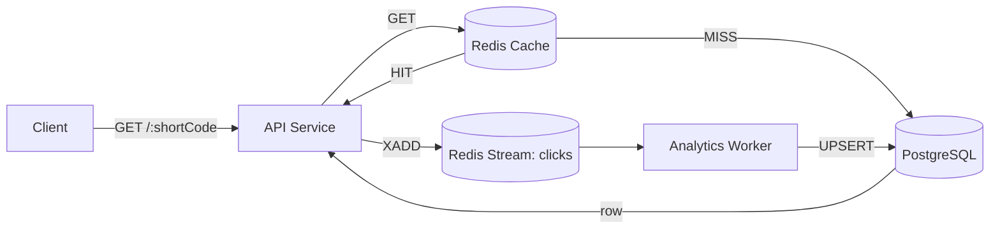
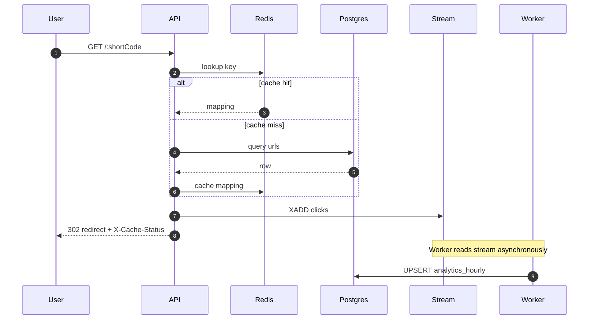

# SnapURL — Distributed URL Shortener

SnapURL is a production-minded distributed URL shortener demonstrating a fast redirect hot path and a durable, asynchronous analytics pipeline. It pairs a read-through Redis cache with a Postgres-backed canonical store and uses Redis Streams to decouple click ingestion from analytics aggregation.


## Quick Highlights

- Two ID strategies: configurable **hash-based** (MD5 truncated + Base62) and **Snowflake-inspired** (timestamp/node/sequence).
- Low-latency redirects via read-through Redis cache; responses include `X-Cache-Status`.
- Durable analytics via Redis Streams consumed by a background worker that performs batched UPSERTs into `analytics_hourly`.
- Containerized, benchmarked, and documented for reproducible local development.

---

## Table of contents

- Project overview
- Architecture & Execution Flow (diagrams)
- Code structure
- Setup & Run (local)
- Usage examples
- Testing & Benchmarking
- Troubleshooting & verification
- Links to detailed docs

---

## Project overview

The goal is to provide a highly available, low-latency URL shortener while capturing useful click analytics without slowing the redirect path. The design optimizes for: fast reads, safe writes, and scalable analytics.

## Architecture & Execution Flow

High-level flow (client -> API -> cache/db -> stream -> worker -> analytics):



Sequence diagram for redirect + analytics:



## Code structure

See the `api/`, `worker/`, and `db/` folders. Key modules:

- `api/src/idGenerator.js` — Base62 encode, MD5 truncated hash generator, Snowflake-inspired generator.
- `api/src/db.js` — Postgres pool and Redis client initialization.
- `api/src/routes.js` — HTTP handlers and full request workflows.
- `worker/src/worker.js` — Consumer group logic, batch processing, UPSERTs and XACKs.

## Setup & Run (Local)

Prereqs: Docker, Docker Compose.

Start the stack:

```powershell
git clone <repository-url>
cd Gpp-20
docker compose up --build -d
```

Check services:

```powershell
docker compose ps
```

API: http://localhost:3000

Environment variables: copy `.env.example` and adjust `DATABASE_URL`, `REDIS_URL`, `BASE_URL`, `NODE_ID`, `WORKER_NAME` as needed.

## Usage examples

Create a short URL:

```bash
curl -X POST http://localhost:3000/api/shorten \
  -H "Content-Type: application/json" \
  -d '{"url":"https://example.com","strategy":"snowflake"}'
```

Redirect test (no follow):

```bash
curl -i -s --max-redirs 0 http://localhost:3000/<shortCode>
```

Analytics API:

```bash
curl http://localhost:3000/api/analytics/<shortCode>
```

## Testing & Benchmarking

Run `k6` via Docker (example):

```powershell
docker run --rm -i --network="gpp-20_shortener-network" \
  -v "${PWD}:/apps" -e BASE_URL="http://api:3000" \
  grafana/k6 run /apps/k6.js
```

Results are recorded in `BENCHMARK.md`.

## Troubleshooting & Verification

- Confirm `X-Cache-Status` is present on redirect responses.
- Use `redis-cli XREAD` to inspect `clicks` stream entries.
- Check `analytics_hourly` rows in Postgres to verify worker upserts.

## Links to detailed docs

- System architecture: [architecture.md](architecture.md)
- Deep project documentation: [projectdocumentation.md](projectdocumentation.md)
- Benchmarks: [BENCHMARK.md](BENCHMARK.md)

---

If you'd like, I will also polish `architecture.md` and `projectdocumentation.md` further and commit the changes — say "commit" to push documentation updates.
