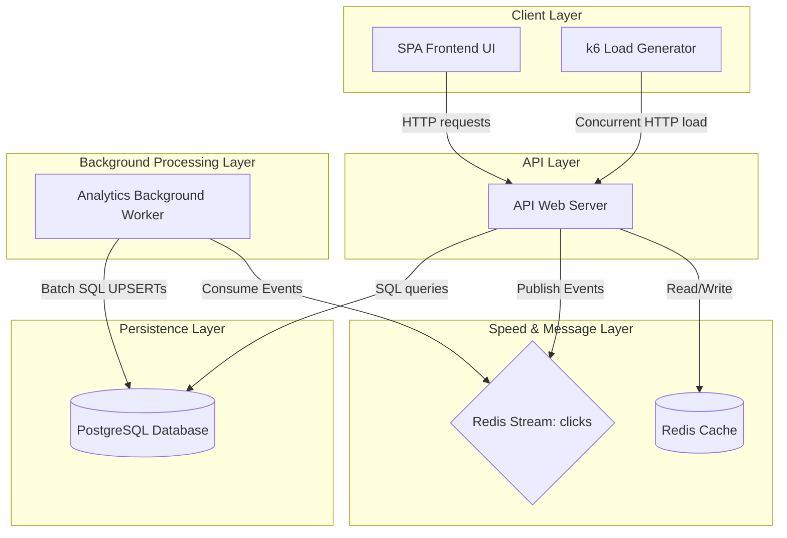
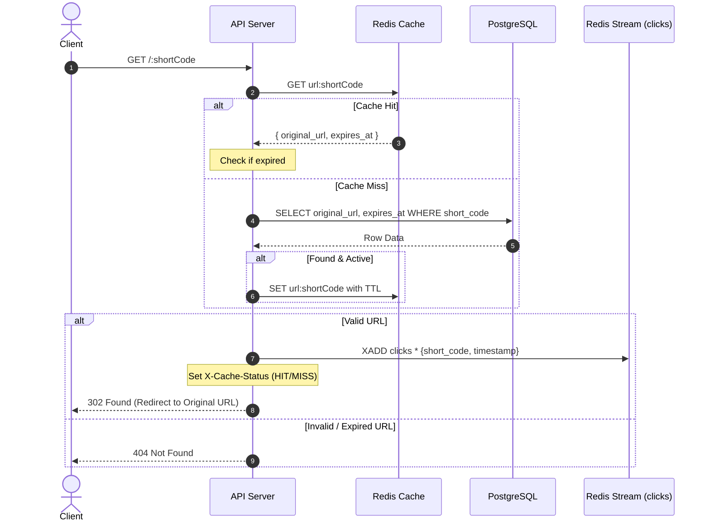
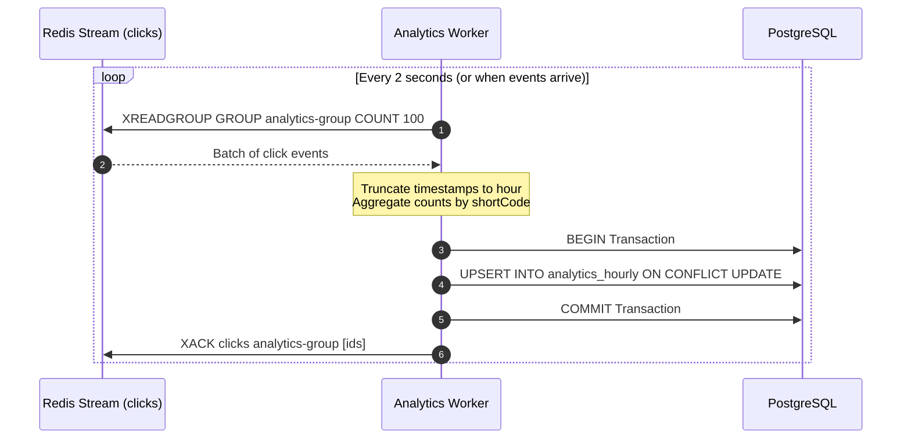

# System Architecture and Design

This document details the architectural design and structural choices for the Distributed URL Shortener.

---

## 1. Architectural Blueprint

The system is designed as an event-driven, microservices-based application containing four primary services coordinated via a Docker network.

---

## 2. Component Isolation

### 2.1. API Web Server (`api`)
- **Primary Function**: Serves as the web gateway handling client requests.
- **Responsibilities**:
  - Exposes REST endpoints for URL shortening, redirection, and analytics.
  - Serves static SPA frontend files (HTML/CSS/JS).
  - Handles the **Hot Path** (redirection lookup) with caching checks.
  - Generates short codes via Hash and Snowflake strategies.
  - Fires event messages to the Redis `clicks` stream asynchronously.

### 2.2. Analytics Background Worker (`worker`)
- **Primary Function**: Decouples write-heavy analytics logging from the redirection hot path.
- **Responsibilities**:
  - Connects to the Redis `clicks` stream using a Consumer Group.
  - Batch-reads up to 100 click events at a time.
  - Performs hourly in-memory aggregation of clicks.
  - Commits aggregated results to PostgreSQL via transaction-safe UPSERT commands.
  - Recovers from crashes by checking for historical pending entries.

### 2.3. PostgreSQL Database (`db`)
- **Primary Function**: The persistent source of truth.
- **Responsibilities**:
  - Stores unique short URL mappings (original URL, expiration, strategy).
  - Stores aggregated hourly analytics counts.
  - Ensures data integrity via primary keys, unique constraints, and indices.

### 2.4. Redis Cache & Broker (`redis`)
- **Primary Function**: Redirection accelerator and event queue.
- **Responsibilities**:
  - Caches database mapping records (Key: `url:<short_code>`) with explicit TTLs.
  - Acts as a message broker through Redis Streams (`clicks`).

---

## 3. Data Flow Patterns

### 3.1. Hot Path: Short Code Redirection
Redirection speed is optimized by eliminating database requests on cache hits.

### 3.2. Asynchronous Analytics Path
Aggregating clicks asynchronously keeps the DB write load low and prevents redirection delays.

---

## 4. ID Generation Strategies

### 4.1. Hash-Based Generator
1. Takes the long URL.
2. Appends an attempt sequence if a database collision occurs (acting as a dynamic salt).
3. Computes the MD5 hash (128 bits).
4. Subarrays the first 6 bytes (48 bits).
5. Encodes the BigInt representation of those bytes into Base62.
6. Returns an 8-character string.

### 4.2. Snowflake-Inspired Generator
Generates a coordinate-free 64-bit BigInt:
$$\text{ID} = (\text{timestamp\_diff} \ll 22) \mid (\text{node\_id} \ll 12) \mid \text{sequence}$$
- **Timestamp**: 41 bits (relative to custom epoch 2026-01-01). Good for 69 years.
- **Node ID**: 10 bits (0-1023), allowing up to 1,024 concurrent application processes.
- **Sequence**: 12 bits (0-4095), allowing up to 4,096 IDs per millisecond per node.
- The 64-bit integer is converted to Base62, yielding a unique, chronologically ordered short code.

---

## 5. System Trade-offs and Design Decisions

### 5.1. Redis Streams vs. Heavy Message Brokers (Kafka/RabbitMQ)
- **Trade-off**: Redis Streams has lower durable disk-write guarantees than Kafka, but it uses the exact same Redis instance already deployed for caching.
- **Decision**: Avoided introducing Kafka or RabbitMQ, which would require massive memory footprints and complex orchestrations, keeping the application fast, lightweight, and single-port integrated.

### 5.2. Batch UPSERTs vs. Real-time DB Logging
- **Trade-off**: Real-time logging records every redirect directly to Postgres, causing high DB disk write latency. Batching delays DB visualization by up to 2-5 seconds.
- **Decision**: Used batching with UPSERTs to ensure the database stays healthy under massive loads and redirections never experience DB bottlenecks.
