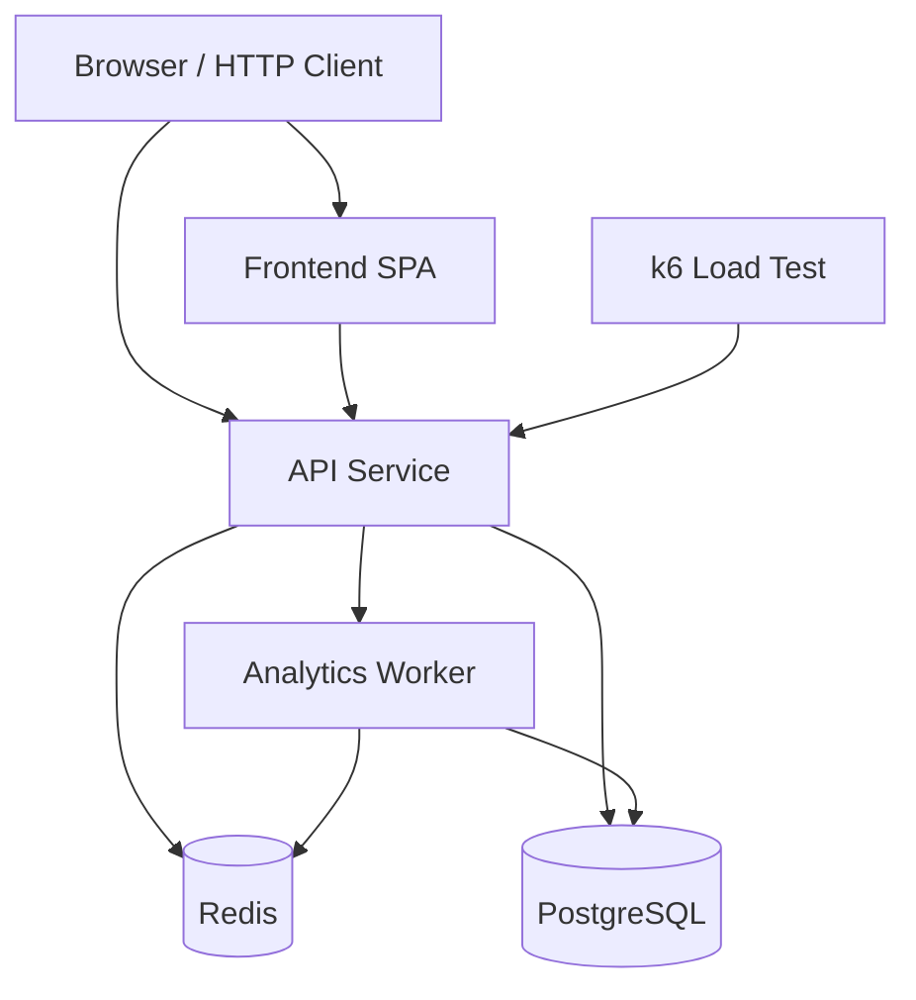
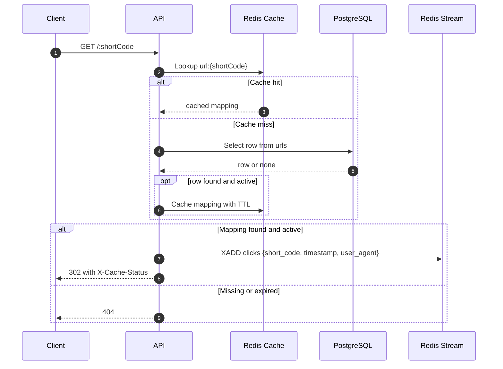
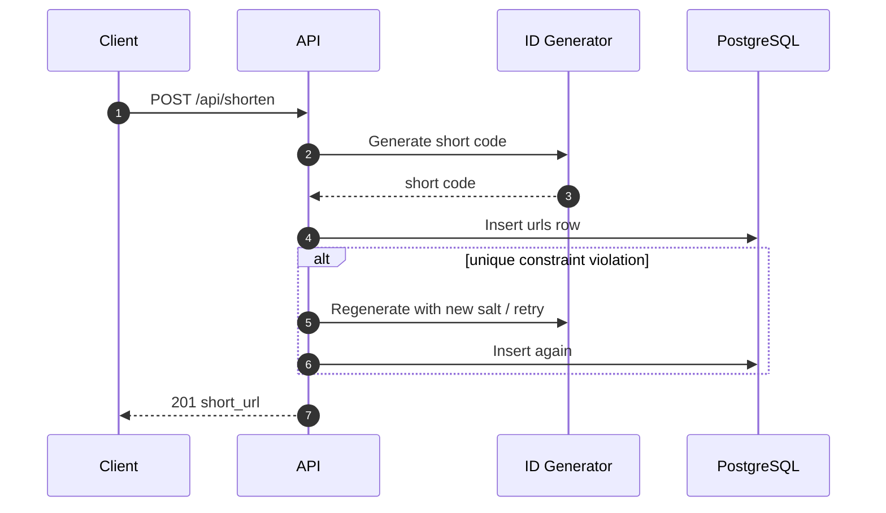
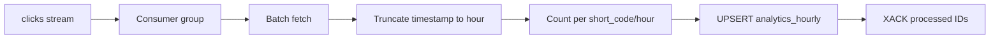

# System Architecture

This document describes the runtime architecture of SnapURL, the boundaries between services, and the data flow that makes the system fast enough for redirect-heavy workloads while keeping analytics reliable.

## 1. Architectural Goal

The project is intentionally split into a synchronous request path and an asynchronous analytics path. The redirect path must be fast, cache-friendly, and resilient. The analytics path must be durable, batched, and decoupled so that click tracking never slows down the redirect response.

## 2. High-Level Topology



## 3. Service Responsibilities

### 3.1 API Service

The API service owns request validation, ID generation, redirect resolution, cache population, analytics reads, and static frontend hosting.

Core responsibilities:

- Accept shortening requests at `POST /api/shorten`.
- Generate short codes using either the hash or snowflake strategy.
- Persist canonical mappings in PostgreSQL.
- Resolve redirects from Redis first, then PostgreSQL.
- Publish click events to the Redis `clicks` stream.
- Expose `GET /api/analytics/:shortCode` for hourly analytics.
- Expose `GET /api/health` for container readiness checks.

### 3.2 Worker Service

The worker is a separate background process whose only responsibility is analytics aggregation.

Core responsibilities:

- Join the `clicks` stream consumer group.
- Read events in batches.
- Normalize timestamps to the hour.
- Upsert hourly aggregates into PostgreSQL.
- Acknowledge processed stream entries.
- Recreate the consumer group if Redis is flushed or restarted.

### 3.3 PostgreSQL

PostgreSQL is the source of truth for the URL mapping table and the aggregated analytics table.

It stores:

- `urls`: canonical short code to original URL mappings.
- `analytics_hourly`: hourly click totals keyed by `short_code` and `hour`.

### 3.4 Redis

Redis plays two roles:

- Read-through cache for redirects.
- Event stream for click analytics.

Redis reduces database pressure by keeping hot redirect data in memory and by batching click events into a durable stream.

## 4. Execution Paths

### 4.1 Redirect Path



### 4.2 Shortening Path



### 4.3 Analytics Path



## 5. Data Model Design

### 5.1 `urls`

- `id SERIAL PRIMARY KEY`
- `short_code VARCHAR(16) UNIQUE NOT NULL`
- `original_url TEXT NOT NULL`
- `strategy VARCHAR(16) NOT NULL`
- `created_at TIMESTAMPTZ NOT NULL DEFAULT NOW()`
- `expires_at TIMESTAMPTZ NULL`

Why it works:

- The unique constraint protects the shortening path against collisions.
- The optional expiration column allows temporary links without extra tables.
- The timestamp columns make operational debugging and cleanup easier.

### 5.2 `analytics_hourly`

- `id SERIAL PRIMARY KEY`
- `short_code VARCHAR(16) NOT NULL`
- `hour TIMESTAMPTZ NOT NULL`
- `click_count INTEGER NOT NULL DEFAULT 1`
- `UNIQUE(short_code, hour)`

Why it works:

- The unique constraint makes UPSERT safe and deterministic.
- Aggregation is coarse-grained by hour, which keeps write volume low.
- This structure is efficient for time-series style queries without a dedicated TSDB.

## 6. ID Generation Strategies

### 6.1 Hash Strategy

The hash strategy uses MD5 plus Base62 encoding. If a unique constraint violation occurs, the generator retries with a different attempt value, which acts as a salt.

Benefits:

- Deterministic for a given URL and retry attempt.
- Short, URL-safe codes.
- Low operational complexity.

Limitations:

- Truncation creates a theoretical collision surface.
- It is not globally ordered.

### 6.2 Snowflake Strategy

The snowflake-inspired generator packs timestamp, node ID, and sequence into a 64-bit integer.

$$
	ext{ID} = (\text{timestamp\_diff} \ll 22) \;|\; (\text{node\_id} \ll 12) \;|\; \text{sequence}
$$

Benefits:

- Collision-resistant across nodes when configured correctly.
- Chronologically sortable.
- Coordination-free generation.

Limitations:

- Requires careful node ID management.
- Sequence exhaustion can stall generation for the next millisecond.

## 7. Resilience and Recovery

The system is designed to survive common failure modes:

- If Redis is flushed, the worker recreates the consumer group.
- If the redirect cache is empty, the API falls back to PostgreSQL.
- If a URL is expired, the redirect path returns `404` rather than serving stale content.
- If a short-code insert collides, the API retries generation before failing.

## 8. Trade-Offs

### Advantages

- Fast redirect latency through Redis cache hits.
- Low write pressure on PostgreSQL through batched analytics.
- Simple deployment story with Docker Compose.
- Clear separation of concerns between API and worker.

### Costs

- Analytics are eventually consistent rather than immediate.
- Redis memory is part of the performance budget.
- Stream processing adds operational complexity compared to a single-process design.

## 9. Integration Points

- API to PostgreSQL for canonical writes and analytics reads.
- API to Redis for caching and stream publication.
- Worker to Redis Streams for durable event consumption.
- Worker to PostgreSQL for batched hourly aggregation.
- Frontend to API for shortening and analytics rendering.

## 10. Why This Structure Scales

The architecture scales because the hot path is kept small and the expensive work is deferred. Redis absorbs read pressure, PostgreSQL stores the source of truth, and the worker performs write-heavy analytics out of band. This prevents a redirect spike from turning into a database bottleneck.

## 11. Deployment Topology and Scaling

```mermaid
graph TD
    LB[Load Balancer] --> APIS[API fleet (multiple nodes)]
    APIS --> RedisCluster[(Redis Cluster)]
    APIS --> PostgresPrimary[(Postgres Primary)]
    PostgresPrimary --> PostgresReplicas[(Read Replicas)]
    WorkerFleet[Worker fleet] --> RedisCluster
    WorkerFleet --> PostgresPrimary
    CDN[CDN / Edge Cache] --> APIS
```

- Typical production setup: multiple API replicas behind a load balancer, a Redis cluster for sharding/scale, one Postgres primary with read replicas, and autoscaling worker instances consuming the stream.
- Use PgBouncer between API/worker and Postgres to limit connections.

## 12. Monitoring and Operational Concerns

- Metrics to collect:
    - API: request latency (p50/p95/p99), error rates, cache hit ratio, DB query latency.
    - Redis: memory usage, stream length, AOF lag, client connections.
    - Worker: consumer lag (PEL size), batch processing time, retry rates.
    - Postgres: replication lag, slow queries, connection count.

- Alerts:
    - Redis stream length grows beyond threshold (indicates worker lag).
    - Postgres replication lag > acceptable window.
    - High `http_req_failed` or steady 5xx rate.

## 13. Security Considerations

- Sanitize and validate user-submitted URLs (avoid SSRF and open-redirect abuses).
- Rate-limit the shorten endpoint to prevent abuse and mass link generation.
- Protect administrative endpoints with authentication.
- Use TLS in production for all external endpoints and internal service communication where possible.

## 14. Operational Runbooks (short)

- Recovering a stalled worker:
    1. Check worker logs for errors and restart the container.
    2. Use `XINFO GROUPS clicks` and `XPENDING clicks analytics-group` to inspect pending entries.
    3. If a consumer crashed holding pending entries, use `XAUTOCLAIM` or `XCLAIM` to move entries to a running consumer.

- Recreating consumer group after Redis reset:
    1. Worker will try to recreate the group on startup (see `worker/src/worker.js`).
    2. If you must rebuild: `XGROUP CREATE clicks analytics-group $ MKSTREAM`.

---

End of architecture notes.
