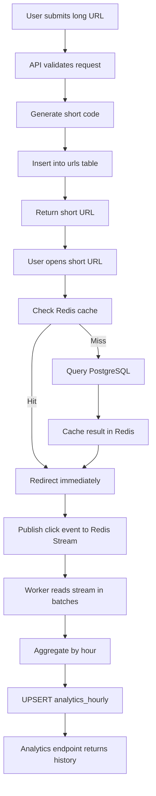
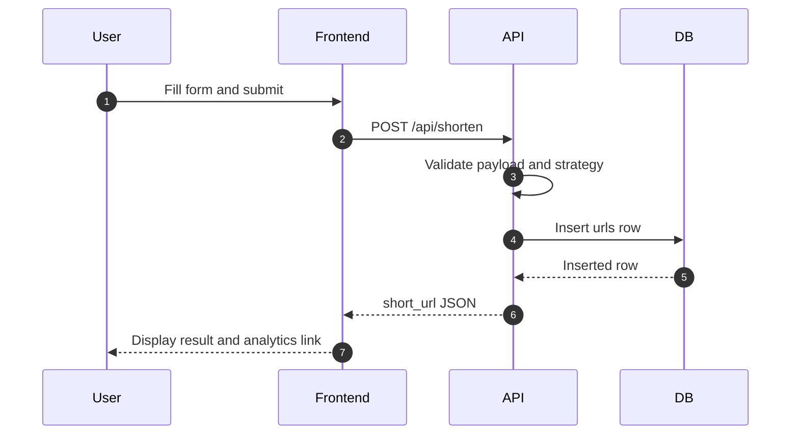
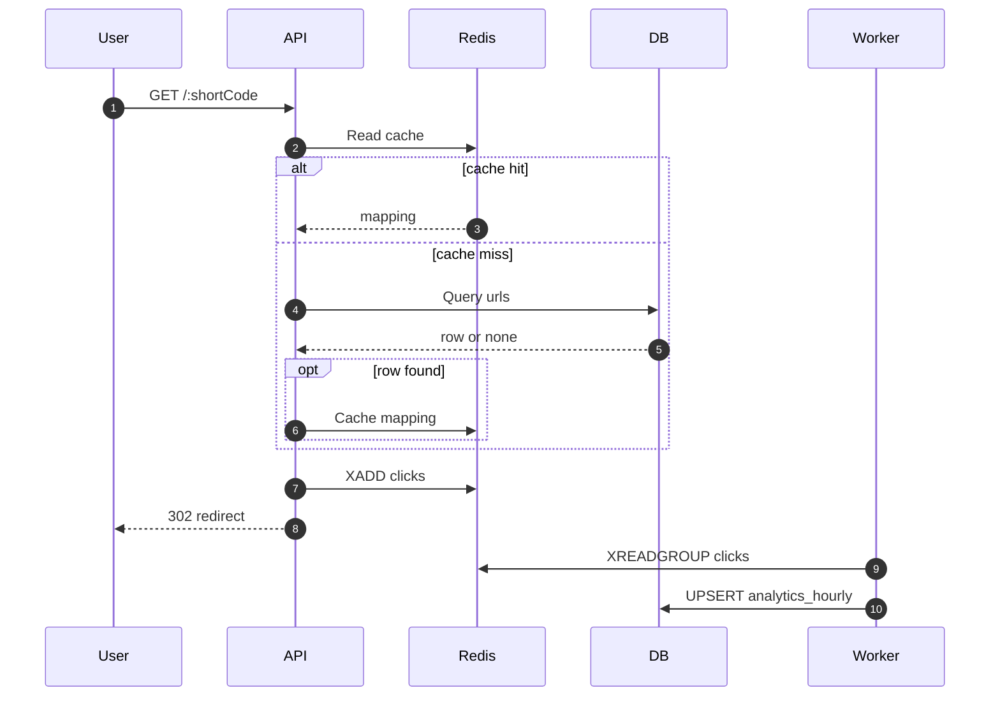

# Project Documentation

## 1. Main Idea

SnapURL is a distributed URL shortener that turns a deceptively simple product into a systems-design exercise. The project shows how to build a fast redirect service, how to avoid central ID allocation bottlenecks, and how to track analytics without slowing down the user-facing path.

The primary objective is to keep redirects fast while still capturing useful metrics. That is accomplished by combining PostgreSQL, Redis, a background worker, and a compact frontend dashboard.

## 2. Project Goals

- Generate collision-resistant short codes without auto-increment IDs.
- Support both hash-based and snowflake-inspired code generation.
- Resolve redirects with a read-through cache.
- Publish click events to Redis Streams.
- Aggregate analytics asynchronously by hour.
- Render analytics in the browser with a simple chart.
- Run the whole system locally through Docker Compose.

## 3. Why These Technologies Were Chosen

| Technology | Why it fits |
| --- | --- |
| Node.js | Good fit for I/O-heavy services, HTTP APIs, and stream processing |
| Express | Minimal and predictable HTTP routing layer |
| PostgreSQL | Durable relational store with constraints, indexing, and UPSERT support |
| Redis | Fast in-memory cache plus built-in stream support |
| Chart.js | Lightweight visualization layer for hourly click trends |
| k6 | Practical load testing tool for API benchmarks |
| Docker Compose | Easiest way to make the whole system reproducible |

## 4. Complete Workflow



## 5. Main Modules and Responsibilities

### 5.1 API Service

#### `api/src/index.js`

- Loads environment variables.
- Sets up Express.
- Enables CORS and JSON parsing.
- Serves the static frontend.
- Waits for database and Redis connections before listening.

#### `api/src/routes.js`

- `GET /api/health`: container readiness.
- `POST /api/shorten`: validate input, generate short code, write to PostgreSQL.
- `GET /:shortCode`: cache lookup, DB fallback, click event publication, redirect.
- `GET /api/analytics/:shortCode`: return aggregated analytics.
- `GET /analytics/:shortCode`: frontend route for the browser dashboard.

#### `api/src/idGenerator.js`

- Converts integers to Base62.
- Implements the MD5-based hash strategy.
- Implements the snowflake-inspired 64-bit generator.
- Uses `NODE_ID` from the environment.

#### `api/src/db.js`

- Creates the PostgreSQL pool.
- Creates the Redis client.
- Retries startup connections so the container can tolerate slow dependency boot.

### 5.2 Worker Service

#### `worker/src/worker.js`

- Starts a small HTTP health server on port 3001.
- Connects to PostgreSQL and Redis.
- Creates or recovers the Redis consumer group.
- Reads click events in batches.
- Groups events by `short_code` and hour.
- Writes aggregates with `INSERT ... ON CONFLICT DO UPDATE`.
- Acknowledges processed stream messages.

### 5.3 Database Layer

#### `db/init.sql`

- Creates `urls` with a unique short code.
- Creates `analytics_hourly` with a composite unique key.
- Adds supporting indexes for common lookups.

## 6. Problem-Solving Approach

### 6.1 Hash-Based ID Generation

The hash strategy is simple and deterministic. The long URL is hashed, truncated to a short numeric space, and encoded in Base62. Because truncation can collide, the API retries with a new attempt value when the unique constraint rejects an insert.

Benefits:

- Stateless at the generator level.
- Easy to reason about and test.
- Produces compact, URL-safe codes.

Trade-off:

- The short code space is smaller than the full hash space, so the database constraint is the final guardrail.

### 6.2 Snowflake-Inspired ID Generation

The snowflake-style generator avoids central coordination by packing timestamp, node ID, and sequence into one 64-bit integer. This makes the identifier unique across distributed API instances when node IDs are assigned correctly.

Benefits:

- Independent generation across nodes.
- Sortable by time.
- Predictable throughput with clear capacity limits.

Trade-off:

- Requires node ID discipline and clock correctness.

### 6.3 Redis Stream Recovery

If Redis is cleared or the worker restarts, the consumer group may disappear. The worker handles that by recreating the group and re-reading pending messages so click events are not silently dropped.

Benefits:

- Better crash recovery.
- Protects against stream resets during testing or deployment.

## 7. Data Flow and Execution Flow

### 7.1 URL Creation Flow



### 7.2 Redirect and Analytics Flow



## 8. Advantages and Benefits

- Clean separation between request serving and analytics processing.
- Low redirect latency through Redis hits.
- Safe analytics writes through batched UPSERTs.
- Good local developer experience through Docker Compose.
- Clear contract surface for automated testing.

## 9. Cons and Limits

- Analytics are eventually consistent, not instantaneous.
- Redis memory must be managed for larger workloads.
- Snowflake requires careful node assignment.
- Hash-based generation still relies on retry logic under collisions.

## 10. Crucial Integration Details

- `api` depends on `db` and `redis` being healthy before startup.
- `worker` depends on the same services and exposes its own health endpoint.
- `db/init.sql` runs automatically on first database startup.
- The frontend calls the API directly and renders charts from `/api/analytics/:shortCode`.
- The benchmark script uses the same HTTP routes as the browser and is suitable for load testing both read and write paths.

## 11. Validation Strategy

The project should be verified in layers:

1. Start the stack with `docker compose up --build -d`.
2. Confirm all four services report healthy with `docker compose ps`.
3. Create short URLs for both strategies.
4. Confirm redirects return `302` and emit `X-Cache-Status`.
5. Confirm Redis `clicks` stream entries appear after redirects.
6. Confirm the worker updates `analytics_hourly`.
7. Confirm the analytics endpoint returns history and totals.
8. Run the k6 benchmark script and record results in `BENCHMARK.md`.

## 12. Final Assessment

This architecture is intentionally pragmatic. It is not the most complicated possible design, but it is a strong fit for the problem: fast reads, durable writes, asynchronous analytics, and simple local deployment. That balance is what makes the system understandable, testable, and scalable.

## 13. API Reference (brief)

- `GET /api/health` — returns 200 when the API is ready.
- `POST /api/shorten` — JSON body `{ url, strategy, expires_at? }`; returns `201` with `{ short_url, short_code }` on success. Strategies: `hash` or `snowflake`.
- `GET /:shortCode` — redirect endpoint. Returns `302` with `Location` and `X-Cache-Status` header.
- `GET /api/analytics/:shortCode` — returns `{ total_clicks, history }` where `history` is an array of `{ hour, clicks }`.

## 14. Environment & Configuration

Important env vars (see `.env.example`):

- `DATABASE_URL` — Postgres connection string
- `REDIS_URL` — Redis connection string
- `BASE_URL` — Public base URL (used to build short URL responses)
- `NODE_ID` — numeric node ID for Snowflake generator
- `WORKER_NAME` — name for the worker consumer instance

## 15. Database Schema (reference)

`urls` table (excerpt):

```sql
CREATE TABLE urls (
  id SERIAL PRIMARY KEY,
  short_code VARCHAR(32) UNIQUE NOT NULL,
  original_url TEXT NOT NULL,
  strategy VARCHAR(16) NOT NULL,
  created_at TIMESTAMPTZ NOT NULL DEFAULT NOW(),
  expires_at TIMESTAMPTZ NULL
);
```

`analytics_hourly` table (excerpt):

```sql
CREATE TABLE analytics_hourly (
  id SERIAL PRIMARY KEY,
  short_code VARCHAR(32) NOT NULL,
  hour TIMESTAMPTZ NOT NULL,
  click_count INTEGER NOT NULL DEFAULT 0,
  UNIQUE(short_code, hour)
);
```

## 16. Redis Stream Tips

- Inspect stream length: `XLEN clicks`.
- Read entries: `XREAD COUNT 10 STREAMS clicks 0`.
- Consumer group info: `XINFO GROUPS clicks` and `XPENDING clicks analytics-group`.

## 17. Testing Strategy

- Unit tests: validate ID generator edge cases, Base62 encoding, and DB helper logic.
- Integration tests: spin up the Docker Compose stack and run smoke tests for shorten -> redirect -> analytics end-to-end.
- Load tests: `k6.js` provides a realistic mix of reads/writes; analyze `BENCHMARK.md` after runs.

## 18. Verification Checklist (detailed)

1. Start stack: `docker compose up --build -d`.
2. Confirm health: `docker compose ps` and `curl http://localhost:3000/api/health`.
3. Create a short URL: `POST /api/shorten` with both strategies.
4. Confirm redirect: `curl -I -L --max-redirs 0 http://localhost:3000/<shortCode>`; check `Location` and `X-Cache-Status`.
5. Inspect Redis stream: `redis-cli XREAD COUNT 5 STREAMS clicks 0` after performing redirects.
6. Verify worker processing: check logs and ensure `analytics_hourly` table has upserted rows.
7. Run `k6` and compare metrics recorded in `BENCHMARK.md`.

## 19. Next Steps & Hardening

- Harden security: input validation, authentication for administrative endpoints, rate limiting.
- Improve analytics durability for extreme retention by integrating Kafka or persistent object storage for event archives.
- Add automated E2E tests (Playwright) for the frontend flow.

---

End of project documentation.
